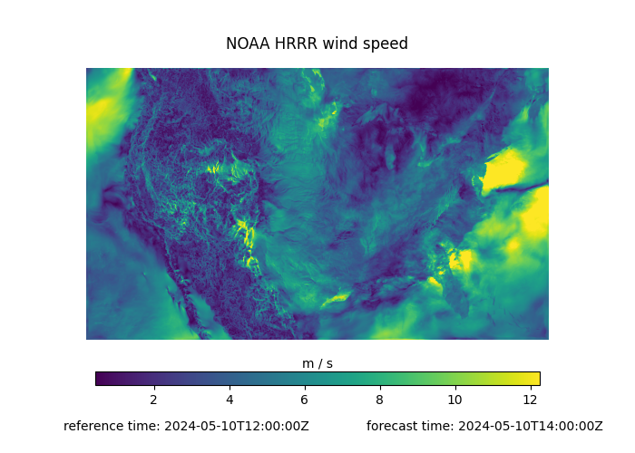

# stactools-noaa-hrrr

[](https://pypi.org/project/stactools-noaa-hrrr/)


- Name: noaa-hrrr
- Package: `stactools.noaa_hrrr`
- [stactools-noaa-hrrr on PyPI](https://pypi.org/project/stactools-noaa-hrrr/)
- Owner: @hrodmn
- [Dataset homepage](https://rapidrefresh.noaa.gov/hrrr/)
- STAC extensions used:
  - [forecast](https://github.com/stac-extensions/forecast)
  - [item-assets](https://github.com/stac-extensions/item-assets)
  - [datacube](https://github.com/stac-extensions/datacube) (coming soon)
- Extra fields:
  - `noaa-hrrr:forecast_cycle_type`: either standard (18-hour) or extended (48-hour)
  - `noaa-hrrr:region`: either `conus` or `alaska`
- [Browse the example in human-readable form](https://radiantearth.github.io/stac-browser/#/external/raw.githubusercontent.com/stactools-packages/noaa-hrrr/main/examples/collection.json)
- [Browse a notebook demonstrating the example item and collection](https://github.com/stactools-packages/noaa-hrrr/tree/main/docs/example.ipynb)



This package can be used to generate STAC metadata for the NOAA High Resolution Rapid
Refresh (HRRR) atmospheric forecast dataset.

The data are uploaded to cloud storage in AWS, Azure, and Google so you can pick
which cloud provider you want to use for the `grib` and `index` hrefs using the
`cloud_provider` argument to the functions in `stactools.noaa_hrrr.stac`.

## Background

The [NOAA HRRR dataset](https://www.nco.ncep.noaa.gov/pmb/products/hrrr/#CO))
is a continuously updated atmospheric forecast data product.

### Data structure

- There are two regions: CONUS and Alaska
- Every hour, new hourly forecasts are generated for many atmospheric attributes
  for each region
  - All hours (`00-23`) get an 18-hour forecast in the `conus` region
  - Forecasts are generated every three hours (`00`, `03`, `06`, etc) in the
    `alaska` region
  - On hours `00`, `06`, `12`, `18` a 48-hour forecast is generated
  - One of the products (`subh`) gets 15 minute forecasts (four per hour per
    attribute), but the sub-hourly forecasts are stored as layers within a
    single GRIB2 file for the forecast hour rather than in separate files.
- The forecasts are broken up into 4 products (`sfc`, `prs`, `nat`, `subh`),  
- Each GRIB2 file has hundreds to thousands of variables
- Each .grib2 file is accompanied by a .grib2.idx which has variable-level
  metadata including the starting byte for the data in that variable (useful
  for making range requests instead of reading the entire file) and some
  other descriptive metadata

### Summary of Considerations for Organizing STAC Metadata

After extensive discussions, we decided to organize the STAC metadata with
the following structure:

1. **Collections**: Separate collections for each region-product combination
    - regions: `conus` and `alaska`
    - products: `sfc`, `prs`, `nat`, and `subh`

2. **Items**: Each GRIB file in the archive is represented as an item with two assets:
    - `"grib"`: Contains the actual data.
    - `"index"`: The .grib2.idx sidecar file.

   Each GRIB file contains the forecasts for all of a product's variables for a
   particular forecast hour from a reference time, so you need to combine data
   from multiple items to construct a time series for a forecast.

3. **`grib:layers`**: Within each `"grib"` asset, a `grib:layers` property details
   each layer's information, including description, units, and byte ranges.
   This enables applications to access specific parts of the GRIB2 files without
   downloading the entire file.

    - We intend to propose a `GRIB` STAC extension with the `grib:layers` property
      for storing byte-ranges after testing this specification out on other GRIB2
      datasets.
    - The layer-level metadata is worth storing in STAC because you can construct
      URIs for specific layers that GDAL can read using either `/vsisubfile` or
      `vrt://`:
      - `/vsisubfile/{start_byte}_{byte_size},/vsicurl/{grib_href}`
      - `vrt:///vsicurl/{grib_href}?bands={grib_message}`, where `grib_message` is
        the index of the layer within the GRIB2 file.
        - under the hood, GDAL's `vrt` driver is reading the sidecar .grib2.idx file
            and translating it into a `/vsisubfile` URI.

### Advantages

- Applications can use `grib:layers` to create layer-specific data sets, facilitating
efficient data handling.
- Splitting by region and product allows defining coherent collection-level datacube
metadata, enhancing accessibility.

### Disadvantages

- Storing layer-level metadata like byte ranges in the STAC metadata bloats the STAC
  items because there are hundreds to thousands of layers in each GRIB2 file.

For more details, please refer to the related [issue discussion](https://github.com/developmentseed/noaa-hrrr/issues/1)
and pull requests [#3](https://github.com/developmentseed/noaa-hrrr/pull/3) and
[#6](https://github.com/developmentseed/noaa-hrrr/pull/6).

## STAC examples

- [Collection](examples/collection.json)
- [Item](examples/hrrr-conus-sfc-2024-05-10T12-FH0/hrrr-conus-sfc-2024-05-10T12-FH0.json)

## Python usage example

- Check out the [example notebook](./docs/example.ipynb) for examples of how to
  create STAC metadata and how to use STAC items with `grib:layers` metadata to
  load the data into xarray.

## Installation

Install `stactools-noaa-hrrr` with pip:

```shell
pip install stactools-noaa-hrrr
```

## Command-line usage

To create a collection object:

```shell
stac noaahrrr create-collection {region} {product} {cloud_provider} {destination_file}
```

e.g.

```shell
stac noaahrrr create-collection conus sfc azure example-collection.json
```

To create an item:

```shell
stac noaahrrr create-item \
  {region} \
  {product} \
  {cloud_provider} \
  {reference_datetime} \
  {forecast_hour} \
  {destination_file}
```

e.g.

```shell
stac noaahrrr create-item conus sfc azure 2024-05-01T12 10 example-item.json
```

To create all items for a date range:

```shell
stac noaahrrr create-item-collection \
  {region} \
  {product} \
  {cloud_provider} \
  {start_date} \
  {end_date} \
  {destination_folder}
```

e.g.

```shell
stac noaahrrr create-item-collection conus sfc azure 2024-05-01 2024-05-31 /tmp/items
```

### Docker

You can launch a jupyterhub server in a docker container with all of the
dependencies installed using these commands:

```shell
docker/build
docker/jupyter
```

Use `stac noaahrrr --help` to see all subcommands and options.

## Contributing

We use [pre-commit](https://pre-commit.com/) to check any changes.
To set up your development environment:

```shell
pip install -e '.[dev]'
pre-commit install
```

To check all files:

```shell
pre-commit run --all-files
```

To run the tests:

```shell
pytest -vv
```

If you've updated the STAC metadata output, update the examples:

```shell
scripts/update-examples
```
